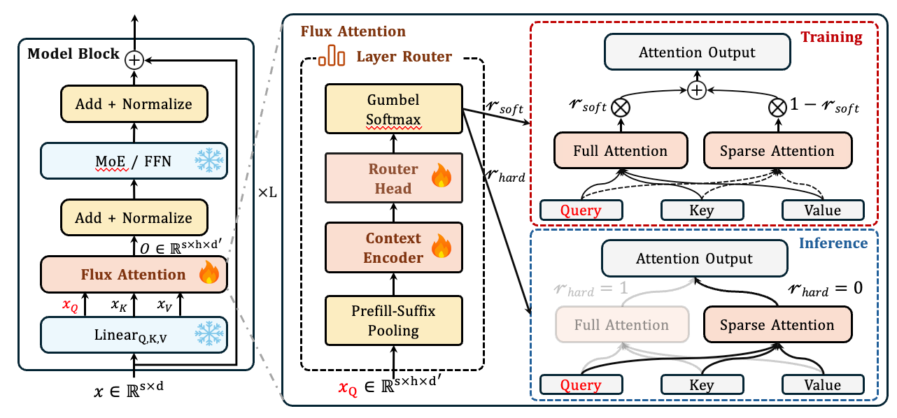

<div align="center">

# 🚀 Flux Attention: Context-Aware Hybrid Attention for Efficient LLMs Inference

[](https://arxiv.org/abs/2604.07394)
[](https://huggingface.co/collections/QQTang1223/flux-attention)
[](https://modelscope.cn/collections/tang031223/Flux-Attention)
[](https://opensource.org/licenses/Apache-2.0)


</div>

---

## 🌐 Project Website

GitHub Pages: [https://qqtang-code.github.io/FluxAttention/](https://qqtang-code.github.io/FluxAttention-Project-Page/)

## 📖 Quick Scan

**Flux Attention** enables models to achieve both **strong performance** and **efficient inference** by dynamically allocating computation modes (Full Attention or Sparse Attention) to each attention layer through our designed Layer Router, adapting sparsity ratios based on input characteristics.



Flux Attention features:
- **High Training Efficiency:** Requires only **12 hours** of training on 8x A800 GPUs for 8B-scale models.
- **Long-Sequence Performance:** Preserves high-fidelity information retrieval, matching backbone models and significantly surpassing baseline methods *(validated on Meta-Llama-3.1-8B-Instruct and Qwen3-series models)*.
- **Inference Acceleration:** Achieves higher sparsity and substantial wall-clock speedups on long-context tasks, avoiding the memory fragmentation typically caused by head-level routing.


## 💻 System Environment

We recommend the following experimental environment, which can reproduce the results in the paper:

| Component | Specification | Notes |
| :--- | :--- | :--- |
| **OS** | Ubuntu 22.04.4 LTS | Tested on ID: `ubuntu` |
| **Python** | 3.11+ | Recommended |
| **PyTorch** | 2.6.0 | Ecosystem compatible |
| **CUDA** | 12.4+ | **Required** |
| **GPU** | NVIDIA A100/H100 (80GB) | High VRAM required |

## ⚙️ Installation

### 1. Setup Python Environment

Clone the repository and set up the basic PyTorch ecosystem.

```bash
# 1: Create a new Python environment
conda create -n flux_attn python=3.11
conda activate flux_attn

# Install PyTorch ecosystem (CUDA 12.4)
pip install torch==2.6.0 torchvision==0.21.0 torchaudio==2.6.0 --index-url https://download.pytorch.org/whl/cu124
```

### 2. Install Dependencies

This project relies on `Block-Sparse-Attention` and other libraries.

> **⚠️  IMPORTANT:**  
> Compilation of CUDA kernels may take up to **5-10 minutes**. Please ensure `nvcc` is in your PATH.

```bash
# 2.1 Install Block-Sparse-Attention (Custom CUDA Ops)
git clone https://github.com/mit-han-lab/Block-Sparse-Attention.git
cd Block-Sparse-Attention

# Ensure CUDA_HOME matches your local path (adjust if necessary)
export CUDA_HOME=/usr/local/cuda-12.4/
python setup.py install
cd ..

# 2.2 Install other python dependencies
pip install -r requirements.txt
pip install modelscope  # Required for data download
```

### 3. Install Flux Attention

```bash
# Clone the repository
git clone https://github.com/LCM-Lab/flux-Attention.git
cd flux-Attention
pip install -e .
```

## 📚 Data Preparation

We use [ModelScope](https://modelscope.cn) to host the datasets. The training data for different models is provided as follows:

- **[Qwen Mix SFT (64K)](https://modelscope.cn/datasets/LCM_group/qwen_mix_sft_64K6)**
- **[LLaMA Mix SFT (64K)](https://modelscope.cn/datasets/LCM_group/llama_mix_sft_64K6)**

### Download Datasets in Code

You can use the following Python snippets to download the datasets programmatically:

```python
from modelscope.msdatasets import MsDataset

# Download Qwen Mix SFT (64K)
dataset_qwen = MsDataset.load('LCM_group/qwen_mix_sft_64K6')

# Download LLaMA Mix SFT (64K)
dataset_llama = MsDataset.load('LCM_group/llama_mix_sft_64K6')
```

> **Tip:** For debugging or small-scale experiments, we provide cached dataset at:
> `fluxattn/public_data/data_cache/demo_data_qwen_packed_maxseq65536.parquet`

## 🏰 Model Zoo

Pre-trained models and checkpoints are available on ModelScope.

| Model Series | Models | Model Collection |
| --- | --- | --- |
| **Flux-Attention Collection** | Qwen3-4B / Qwen3-8B / Llama3.1-8B-Instruct | [](https://huggingface.co/collections/QQTang1223/flux-attention) / [](https://modelscope.cn/collections/tang031223/Flux-Attention) |

## 🏃 Training

To start training with the provided demo data, utilize the included startup script.

```bash
# Grant execution permissions
chmod +x fluxattn/run_scripts/training.sh

cd fluxattn
# Run the training script
bash run_scripts/training.sh

```

> **Configuration:** Batch size, learning rate, and other hyperparameters can be modified inside `fluxattn/run_scripts/training.sh`.

## ⚡ Quick Start (Inference)

Here is a minimal example of how to use Flux Attention for text generation.

<details>
<summary><b> 👇 Click to expand the Inference Code</b></summary>

```python
import torch
import json
from transformers import AutoTokenizer, AutoModelForCausalLM

def load_sparse_model(model_path):
    """
    Dynamically loads the correct sparse architecture based on config.
    """
    config_path = f"{model_path}/config.json"
    with open(config_path, "r") as f:
        config_data = json.load(f)

    arch = config_data.get("architectures", [])
    if not arch:
        raise ValueError("No architecture found in config.json")

    arch_name = arch[0]
    print(f"🚀 Detected architecture: {arch_name}")

    # Register custom architectures
    if "PawLlama" in arch_name:
        from fluxattn.training.eval.modeling_flash_llama import (
            PawLlamaForCausalLM, PawLlamaConfig
        )
        AutoModelForCausalLM.register(PawLlamaConfig, PawLlamaForCausalLM)
        model_cls = PawLlamaForCausalLM
        
    elif "PawQwen" in arch_name:
        from fluxattn.training.eval.modeling_flash_qwen import (
            PawQwen3ForCausalLM, PawQwen3Config
        )
        AutoModelForCausalLM.register(PawQwen3Config, PawQwen3ForCausalLM)
        model_cls = PawQwen3ForCausalLM
    else:
        raise ValueError(f"Unsupported architecture: {arch_name}")

    # Load model
    model = model_cls.from_pretrained(
        model_path,
        torch_dtype=torch.bfloat16,
        device_map="auto",
        trust_remote_code=True,
    )
    return model

# --- Execution ---
model_path = "****" # <--- Replace with your checkpoint path
tokenizer = AutoTokenizer.from_pretrained(model_path, trust_remote_code=True)

print("Loading Flux Attention Model...")
model = load_sparse_model(model_path)
model.eval()

# Generate
input_text = "Explain quantum mechanics in one sentence."
inputs = tokenizer(input_text, return_tensors="pt").to("cuda")

print("Generating...")
outputs = model.generate(**inputs, max_new_tokens=100)
print("\nOutput:\n" + tokenizer.decode(outputs[0], skip_special_tokens=True))

```

</details>

## ⚖️ Evaluation

We recommend using **[LOOM-Eval](https://github.com/LCM-Lab/LOOM-Eval)** for comprehensive evaluation of long-context capabilities.

```bash
# 1. Clone and Install
git clone [https://github.com/LCM-Lab/LOOM-Eval.git](https://github.com/LCM-Lab/LOOM-Eval.git)
cd LOOM-Eval
pip install -e .

# 2. Run Evaluation
loomeval.run \ 
  --model_path /path/to/model \
  --cfg_path /benchmarks/General/RULER/configs/RULER.yaml \
  --server transformers \
  --acceleration fluxattn \
  --device 0 1 2 3 4 5 6 7 \
  --gp_num 1 \
  --output_dir /path/to/results

```

## 🔗 Related Implementations

We acknowledge and reference the following open-source implementations:

| Method | Repository |
| --- | --- |
| **XAttention** | [mit-han-lab/x-attention](https://github.com/mit-han-lab/x-attention) |
| **PruLong** | [princeton-pli/PruLong](https://github.com/princeton-pli/PruLong) |

## 🌟 Contributors

We would like to express our special thanks to the following major contributors for their significant efforts and dedication to this project:

- **Yi Yang** - [GitHub: @yy-fighting](https://github.com/yy-fighting)
- **Zhiyi Hong** - [GitHub: @ACEEE-1222](https://github.com/ACEEE-1222)


## 📬 Contact

If you have any questions, please connect us with: `q_qtang@163.com`.


## 📝 Citation

If you find this project useful in your research, please consider citing:

```bibtex
@misc{qiu2026fluxattentioncontextawarehybrid,
      title={Flux Attention: Context-Aware Hybrid Attention for Efficient LLMs Inference}, 
      author={Quantong Qiu and Zhiyi Hong and Yi Yang and Haitian Wang and Kebin Liu and Qingqing Dang and Juntao Li and Min Zhang},
      year={2026},
      eprint={2604.07394},
      archivePrefix={arXiv},
      primaryClass={cs.LG},
      url={https://arxiv.org/abs/2604.07394}, 
}
