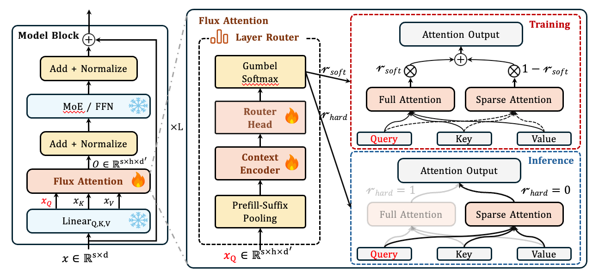

<div align="center">

# 🚀 Flux Attention: Context-Aware Hybrid Attention for Efficient LLMs Inference

[](#-news)
[](https://arxiv.org/abs/2604.07394v2)
[](https://huggingface.co/collections/QQTang1223/flux-attention)
[](https://modelscope.cn/collections/tang031223/Flux-Attention)
[](https://opensource.org/licenses/Apache-2.0)

</div>

---

## 🎉 News

- **[2026-09]** Flux Attention has been **accepted to NeurIPS 2026**. 🎉
- **[2026-09]** Repository reorganised into `fluxattn/{kernels,models,batch,training,eval}`. Model imports moved: `fluxattn.training.eval.modeling_flash_qwen` → `fluxattn.models.modeling_qwen3`, `fluxattn.training.modeling_flash_qwen` → `fluxattn.training.modeling.modeling_qwen3`, and the training entry point is now `python -m fluxattn.training.train`.
- **[2026-09]** Batched inference: per-sample dense/streaming routing in a single FlexAttention launch. See [Multi-Batch Inference](#-multi-batch-inference-per-sample-routing).

## 🌐 Project Website

Project page: [https://qqtang-code.github.io/FluxAttention-Project-Page/](https://qqtang-code.github.io/FluxAttention-Project-Page/)

## 📖 Quick Scan

**Flux Attention** enables models to achieve both **strong performance** and **efficient inference** by dynamically allocating computation modes (Full Attention or Sparse Attention) to each attention layer through our designed Layer Router, adapting sparsity ratios based on input characteristics.



Flux Attention features:
- **High Training Efficiency:** Requires only **12 hours** of training on 8x A800 GPUs for 8B-scale models.
- **Long-Sequence Performance:** Preserves high-fidelity information retrieval, matching backbone models and significantly surpassing baseline methods *(validated on Meta-Llama-3.1-8B-Instruct and Qwen3-series models)*.
- **Inference Acceleration:** Achieves higher sparsity and substantial wall-clock speedups on long-context tasks, avoiding the memory fragmentation typically caused by head-level routing.
- **Multi-Batch Inference:** Routes every sequence in a batch independently, so a dense request and a streaming request share one forward pass instead of one batch-wide decision.

## 📂 Repository Structure

```
FluxAttention/
├── fluxattn/                       # installable package (pip install -e .)
│   ├── kernels/                    # XAttention block-sparse prefill kernels
│   │   └── xattention.py           # Xattention_prefill_dim3 / _dim4
│   ├── batch/                      # per-sample routed attention (FlexAttention)
│   │   ├── flex_attn.py            # the routed kernel
│   │   ├── modeling.py             # model-layout adapter, router -> route conversion
│   │   ├── config.py               # StreamingConfig(window, sink, causal)
│   │   ├── reference.py            # slow softmax oracle used by the tests
│   │   └── baselines.py            # optional flash-attn baselines
│   ├── models/                     # inference models (KV cache, generate)
│   │   ├── modeling_llama.py       # PawLlamaForCausalLM
│   │   └── modeling_qwen3.py       # PawQwen3ForCausalLM
│   ├── training/                   # training pipeline
│   │   ├── train.py                # entry point: python -m fluxattn.training.train
│   │   ├── trainer.py              # FSDP / sequence-parallel trainer
│   │   ├── dataset.py              # packed long-context datasets
│   │   ├── arguments.py            # ScriptArguments / TrainingArguments
│   │   └── modeling/               # training-time model variants
│   └── eval/                       # evaluation-side helpers (argument parsing)
├── integrations/
│   └── nano-vllm/                  # nano-vLLM with the Flux Attention kernels wired in
├── scripts/                        # training launchers (torchrun + FSDP)
├── benchmarks/                     # routed vs. dense attention benchmarks
├── tests/                          # correctness tests
└── figures/
```

Two variants of each backbone are shipped: `fluxattn/models/` holds the inference
models (KV cache + `generate`), while `fluxattn/training/modeling/` holds the
training variants, whose forward also returns the routing auxiliary outputs.
Both register the same architecture names (`PawLlamaForCausalLM`,
`PawQwen3ForCausalLM`), so use the pair that matches the workflow.

## 💻 System Environment

We recommend the following experimental environment, which can reproduce the results in the paper:

| Component | Specification | Notes |
| :--- | :--- | :--- |
| **OS** | Ubuntu 22.04.4 LTS | Tested on ID: `ubuntu` |
| **Python** | 3.11+ | Recommended |
| **PyTorch** | 2.6.0 | Ecosystem compatible |
| **CUDA** | 12.4+ | **Required** |
| **GPU** | NVIDIA A100/H100 (80GB) | High VRAM required |

## ⚙️ Installation

### 1. Setup Python Environment

Clone the repository and set up the basic PyTorch ecosystem.

```bash
# 1: Create a new Python environment
conda create -n flux_attn python=3.11
conda activate flux_attn

# Install PyTorch ecosystem (CUDA 12.4)
pip install torch==2.6.0 torchvision==0.21.0 torchaudio==2.6.0 --index-url https://download.pytorch.org/whl/cu124
```

### 2. Install Dependencies

This project relies on `Block-Sparse-Attention` and other libraries.

> **⚠️  IMPORTANT:**  
> Compilation of CUDA kernels may take up to **5-10 minutes**. Please ensure `nvcc` is in your PATH.

```bash
# 2.1 Install Block-Sparse-Attention (Custom CUDA Ops)
git clone https://github.com/mit-han-lab/Block-Sparse-Attention.git
cd Block-Sparse-Attention

# Ensure CUDA_HOME matches your local path (adjust if necessary)
export CUDA_HOME=/usr/local/cuda-12.4/
python setup.py install
cd ..

# 2.2 Install other python dependencies
pip install -r requirements.txt
pip install modelscope  # Required for data download
```

### 3. Install Flux Attention

```bash
# Clone the repository
git clone https://github.com/qqtang-code/FluxAttention.git
cd FluxAttention
pip install -e .
```

## 📚 Data Preparation

We use [ModelScope](https://modelscope.cn) to host the datasets. The training data for different models is provided as follows:

- **[Qwen Mix SFT (64K)](https://modelscope.cn/datasets/LCM_group/qwen_mix_sft_64K6)**
- **[LLaMA Mix SFT (64K)](https://modelscope.cn/datasets/LCM_group/llama_mix_sft_64K6)**

### Download Datasets in Code

You can use the following Python snippets to download the datasets programmatically:

```python
from modelscope.msdatasets import MsDataset

# Download Qwen Mix SFT (64K)
dataset_qwen = MsDataset.load('LCM_group/qwen_mix_sft_64K6')

# Download LLaMA Mix SFT (64K)
dataset_llama = MsDataset.load('LCM_group/llama_mix_sft_64K6')
```

> **Tip:** For debugging or small-scale experiments, we provide cached dataset at:
> `fluxattn/public_data/data_cache/demo_data_qwen_packed_maxseq65536.parquet`

## 🏰 Model Zoo

Pre-trained models and checkpoints are available on ModelScope.

| Model Series | Models | Model Collection |
| --- | --- | --- |
| **Flux-Attention Collection** | Qwen3-4B / Qwen3-8B / Llama3.1-8B-Instruct | [](https://huggingface.co/collections/QQTang1223/flux-attention) / [](https://modelscope.cn/collections/tang031223/Flux-Attention) |

## 🏃 Training

To start training with the provided demo data, use the launcher in `scripts/`:

```bash
# Run training (wraps torchrun + the FSDP configuration)
./scripts/train_qwen3_4b.sh
```

The launcher only builds the distributed command line; the training entry point itself is a module:

```bash
python -m fluxattn.training.train --help
```

> **Configuration:** the model path, dataset path, batch size, learning rate and the streaming/router hyperparameters are environment-overridable variables at the top of `scripts/train_qwen3_4b.sh`.

## ⚡ Quick Start (Inference)

Here is a minimal example of how to use Flux Attention for text generation.

<details>
<summary><b> 👇 Click to expand the Inference Code</b></summary>

```python
import torch
import json
from transformers import AutoTokenizer, AutoModelForCausalLM

def load_sparse_model(model_path):
    """
    Dynamically loads the correct sparse architecture based on config.
    """
    config_path = f"{model_path}/config.json"
    with open(config_path, "r") as f:
        config_data = json.load(f)

    arch = config_data.get("architectures", [])
    if not arch:
        raise ValueError("No architecture found in config.json")

    arch_name = arch[0]
    print(f"🚀 Detected architecture: {arch_name}")

    # Register custom architectures
    if "PawLlama" in arch_name:
        from fluxattn.models.modeling_llama import (
            PawLlamaForCausalLM, PawLlamaConfig
        )
        AutoModelForCausalLM.register(PawLlamaConfig, PawLlamaForCausalLM)
        model_cls = PawLlamaForCausalLM
        
    elif "PawQwen" in arch_name:
        from fluxattn.models.modeling_qwen3 import (
            PawQwen3ForCausalLM, PawQwen3Config
        )
        AutoModelForCausalLM.register(PawQwen3Config, PawQwen3ForCausalLM)
        model_cls = PawQwen3ForCausalLM
    else:
        raise ValueError(f"Unsupported architecture: {arch_name}")

    # Load model
    model = model_cls.from_pretrained(
        model_path,
        torch_dtype=torch.bfloat16,
        device_map="auto",
        trust_remote_code=True,
    )
    return model

# --- Execution ---
model_path = "****" # <--- Replace with your checkpoint path
tokenizer = AutoTokenizer.from_pretrained(model_path, trust_remote_code=True)

print("Loading Flux Attention Model...")
model = load_sparse_model(model_path)
model.eval()

# Generate
input_text = "Explain quantum mechanics in one sentence."
inputs = tokenizer(input_text, return_tensors="pt").to("cuda")

print("Generating...")
outputs = model.generate(**inputs, max_new_tokens=100)
print("\nOutput:\n" + tokenizer.decode(outputs[0], skip_special_tokens=True))

```

</details>

## 🧩 Multi-Batch Inference (Per-Sample Routing)

Serving several requests in one forward pass needs a routing decision **per sequence**, not per batch: whether streaming attention is safe is a property of an individual context, not of the requests it happens to share a batch with. `fluxattn.batch` implements this on top of PyTorch **FlexAttention** — a single kernel launch serves a batch in which some sequences run dense attention and others run streaming attention (attention sink + sliding window).

Dense and streaming samples are distinguished inside one `mask_mod`, so FlexAttention prunes the out-of-window KV blocks of the streaming samples while building the block mask: no second kernel launch, no regrouping of the batch.

```python
import torch
from fluxattn.batch import StreamingConfig, batch_flux_attention

B, H, S, D = 8, 16, 4096, 128
q, k, v = (torch.randn(B, H, S, D, device="cuda", dtype=torch.bfloat16) for _ in range(3))

# 0 = dense (full causal), 1 = streaming (sink + sliding window)
route = torch.tensor([0, 1, 1, 1, 0, 1, 0, 1], device="cuda", dtype=torch.int32)
cfg = StreamingConfig(window=1024, sink=128, causal=True)

out = batch_flux_attention(q, k, v, route, cfg)   # [B, H, S, D]
```

The model-facing adapter takes the layout the Flux Attention models use (`q` as `[B, S, H, D]`, GQA heads allowed) and keeps the route tensor in a stable buffer so the compiled block-mask builder is not invalidated on every step:

```python
from fluxattn.batch import BatchedRoutedAttention, route_from_sparse_mask

runner = BatchedRoutedAttention(window=1024, sink=128)
route = route_from_sparse_mask(res["sparse_mask"])   # router z -> [B] route
out = runner(q_bshd, k_bshd, v_bshd, route)          # [B, S, H, D]
```

### Enabled in the inference path

`fluxattn/models/modeling_qwen3.py` and `fluxattn/models/modeling_llama.py` use per-sample routing automatically whenever a forward pass carries more than one sequence and `toggle_type == "streaming"`. The router's decisions used to be collapsed into a single batch-wide gate, which is only well defined for one sequence; multi-sequence batches now keep each sequence's own decision. Set `use_batch_routed_attention: false` in the model config to go back to the batch-wide gate.

Per sample, the route selects:
- `route = 0` → exact causal attention over the whole (cached) sequence.
- `route = 1` → streaming attention: the first `sink_size` tokens plus the most recent `local_window_size` tokens, rounded up to the 128-token blocks used by `block_streaming_attn_func`.

### Tests and benchmark

`tests/test_batch_flux_attention.py` checks the kernel against a materialised softmax oracle (prefill, decode against a cache, GQA, mixed routes, all-dense, all-streaming) and `benchmarks/bench_batch_routing.py` compares it with dense baselines. Commands are in [Development](#-development).

### Notes and limitations

- Requires CUDA and a `head_dim` supported by FlexAttention (a multiple of 16).
- The routed path does not depend on `retrieval_mode`: samples routed dense use exact full attention rather than the `xattn` block-selection approximation.
- `window` and `sink` are exact token counts in the mask, while the block-sparse baseline keeps whole 128-token blocks, so a routed streaming sample may see up to 127 fewer tokens of context than the `block_streaming_attn_func` path.
- Each distinct `(query length, cache length, query offset)` builds its own block mask, so decoding against a growing cache rebuilds it on every step. Prefill batches (`S == Sk`) are unaffected.

## 🚀 Serving with nano-vLLM

`integrations/nano-vllm/` is [nano-vLLM](https://github.com/GeeeekExplorer/nano-vllm) with Flux Attention wired into its Qwen3 attention layer (the layer router runs during prefill and selects full or windowed attention) for throughput-oriented offline inference:

```bash
pip install -e integrations/nano-vllm
python integrations/nano-vllm/example.py
```

See `integrations/nano-vllm/README.md` for the configuration and benchmark numbers.

## ⚖️ Evaluation

We recommend using **[LOOM-Eval](https://github.com/LCM-Lab/LOOM-Eval)** for comprehensive evaluation of long-context capabilities.

```bash
# 1. Clone and Install
git clone https://github.com/LCM-Lab/LOOM-Eval.git
cd LOOM-Eval
pip install -e .

# 2. Run Evaluation
loomeval.run \ 
  --model_path /path/to/model \
  --cfg_path /benchmarks/General/RULER/configs/RULER.yaml \
  --server transformers \
  --acceleration fluxattn \
  --device 0 1 2 3 4 5 6 7 \
  --gp_num 1 \
  --output_dir /path/to/results

```

## 🧪 Development

```bash
# Editable install with the dev extras (black, flake8, pytest)
pip install -e ".[dev]"

# Correctness tests: the FlexAttention cases need CUDA, the rest run on CPU
pytest tests/ -q

# Routed attention against dense baselines
python benchmarks/bench_batch_routing.py --B 8 --S 16384 --D 128 --window 2048 --sink 1024 --ratio 0.5
python benchmarks/bench_batch_routing.py --B 32 --S 4096 --D 128 --qlen 1 --ratio 0.5   # decode
```

## 🔗 Related Implementations

We acknowledge and reference the following open-source implementations:

| Method | Repository |
| --- | --- |
| **XAttention** | [mit-han-lab/x-attention](https://github.com/mit-han-lab/x-attention) |
| **PruLong** | [princeton-pli/PruLong](https://github.com/princeton-pli/PruLong) |

## 🌟 Contributors

We would like to express our special thanks to the following major contributors for their significant efforts and dedication to this project:

- **Yi Yang** - [GitHub: @yy-fighting](https://github.com/yy-fighting)
- **Zhiyi Hong** - [GitHub: @ACEEE-1222](https://github.com/ACEEE-1222)


## 📬 Contact

If you have any questions, please connect us with: `q_qtang@163.com`.


## 📝 Citation

If you find this project useful in your research, please consider citing:

```bibtex
@article{qiu2026flux,
  title={Flux Attention: Context-Aware Hybrid Attention for Efficient LLMs Inference},
  author={Qiu, Quantong and Hong, Zhiyi and Yang, Yi and Wang, Haitian and Liu, Kebin and Dang, Qingqing and Li, Juntao and Zhang, Min},
  journal={arXiv preprint arXiv:2604.07394},
  year={2026}
}
```
